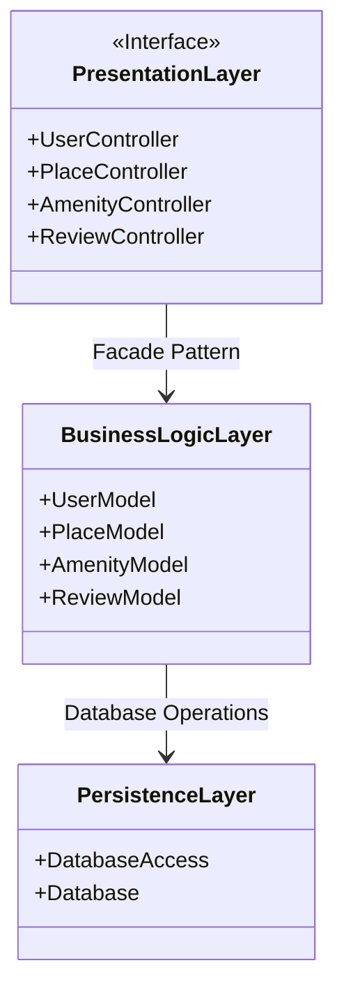

# 🎨 **HBNB - Architecture and UML Modeling**  

## 🔎 **Introduction**  
This project aims to design a **place reservation application** using a well-structured architecture and complete UML modeling.  
The application allows users to:  
- ✍️ **Sign up**  
- 🔍 **Search for places** based on specific criteria  
- ✨ **Leave reviews**  
- 🛋️ **View available amenities**  

This document details the application's architecture and the various UML diagrams used to model the system:  
- [🎨 **Architecture Diagram**](./task0/architecture.mmd) 
- [📚 **Class Diagram**](./task1/classdiagram.mmd)  
- [🔄 **Sequence Diagrams**](./task2/) : Account creation, Place search, Review deletion  

---

## 🎨 **Architecture Diagram**  
The application's architecture is divided into three distinct layers:  

- 🖥️ **Presentation Layer**  
- ⚙️ **Business Logic Layer**  
- 🗄️ **Persistence Layer**  

> ![📊 **Architecture Diagram**]  

---

# 🏗️ **Project Architecture**  

## 🖥️ **Presentation Layer**  

This layer contains various **controllers** to manage user interactions.  
It uses the **Facade Pattern** to communicate with the **Business Logic Layer**, simplifying function calls.  

**Example controllers**:  
- `UserController`  
- `PlaceController`  
- `ReviewController`  

---

## ⚙️ **Business Logic Layer**  

This layer contains the **models** and **business logic**.  
It performs necessary processing before interacting with the database.  

**Example models**:  
- `UserModel`  
- `PlaceModel`  
- `ReviewModel`  

---

## 🗄️ **Persistence Layer**  

Responsible for **database communication**.  
Uses **CRUD operations** to securely manage data.  

**Examples**:  
- `DatabaseAccess`  
- `Database`  

---

# 📚 **Class Diagram**  

The class diagram represents the **structure of the system's main entities**.  
It defines **attributes** and **methods** associated with each class.  
**Relationships** between classes (*associations, aggregations, compositions*) are also represented.  

### 🧩 **Main Classes**  

- **User** 👤 :  
  - Manages user information such as **first name**, **last name**, **email** (private), **password** (private), and **admin status** (private).  

- **Place** 📍 :  
  - Represents places available for booking with a **title**, **description**, **price**, **geographic coordinates**, and an **owner**.  

- **Review** ⭐ :  
  - Allows users to leave a review on a place with a **rating** and a **comment**.  

- **Amenity** 🛋️ :  
  - Defines the **amenities** available for each place.  

- **AmenitiesPlaces** 🔗 :  
  - A linking class to manage relationships between **places** and their **amenities**.  

### 🔗 **Important Relationships**  

- **Composition** 🧱 :  
  Used for `Place` and `Review` as a review depends entirely on the existence of a place.  

- **Aggregation** 🔗 :  
  Used for `AmenitiesPlaces` as a place can exist independently of associated amenities.  

> ![📚 **Class Diagram**]  
> *To be inserted here*  

---

# 🔄 **Sequence Diagrams**  

Sequence diagrams describe the interactions between different components during the execution of **specific use cases**:  

### 🔐 **1. Account Creation**  

- ✅ **Success (201 Created)** :  
  - The user is successfully registered.  

- ⚠️ **Failure (400 Bad Request)** :  
  - If the provided data is invalid.  

- 🔄 **Conflict (409 Conflict)** :  
  - If the email is already in use.  

- ❌ **Server Error (500 Internal Server Error)** :  
  - In case of an internal problem.  

---

### 🔍 **2. Place Search with Criteria**  

- ✅ **200 OK** :  
  - Returns the results matching the criteria or an empty list if no results are found.  

- ⚠️ **400 Bad Request** :  
  - If the criteria are invalid.  

- ❌ **500 Internal Server Error** :  
  - In case of a problem during the search.  

---

### 🗑️ **3. Review Deletion**  

- ✅ **204 No Content** :  
  - The review is successfully deleted.  

- ⚠️ **400 Bad Request** :  
  - If the provided ID is invalid.  

- ❓ **404 Not Found** :  
  - If the review does not exist.  

- ❌ **500 Internal Server Error** :  
  - In case of a problem during the deletion.  

> ![🔄 **Sequence Diagrams**]  
> *To be inserted here*  

---

# ✅ **Conclusion**  

This project follows a **layered architecture** using the **Facade Pattern** to simplify interactions between the **Presentation Layer** and the **Business Logic Layer**.  
**UML modeling** provides a clear understanding of the system's structure and interactions before implementation.  

With this organization, the application is **easily maintainable** and **scalable**.  
Feel free to check out the GitHub repository to explore the diagrams in more detail and track the project's progress.
